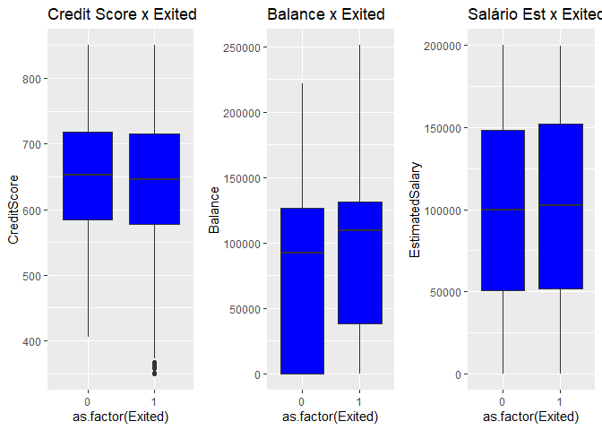
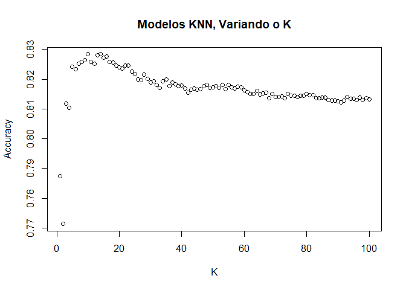
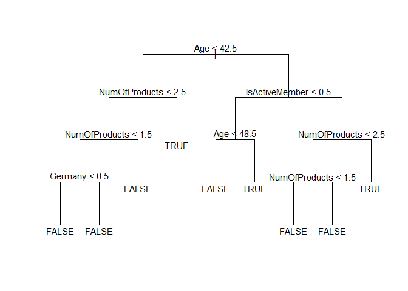
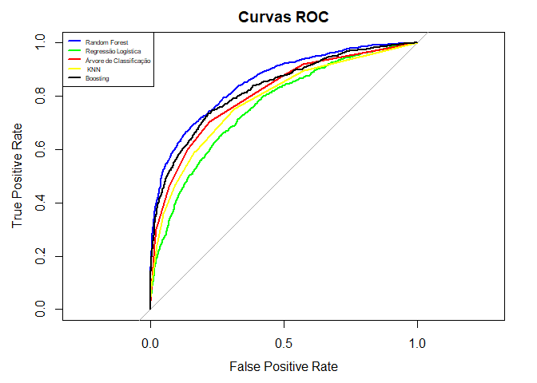
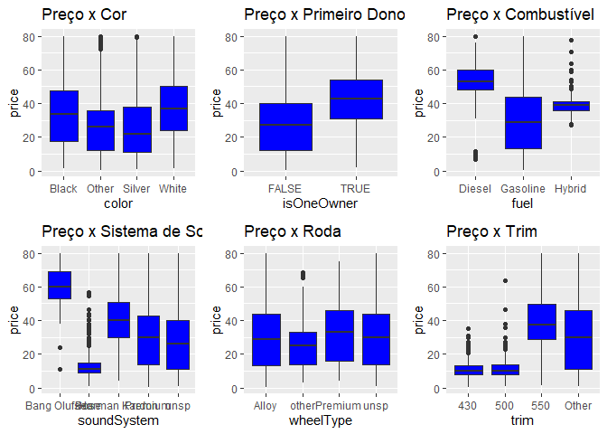
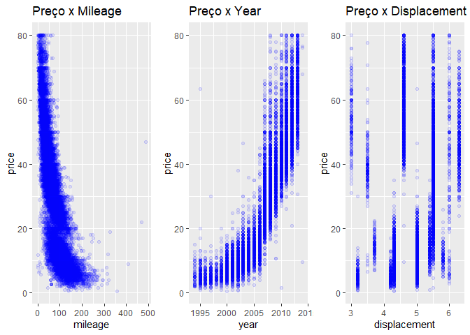
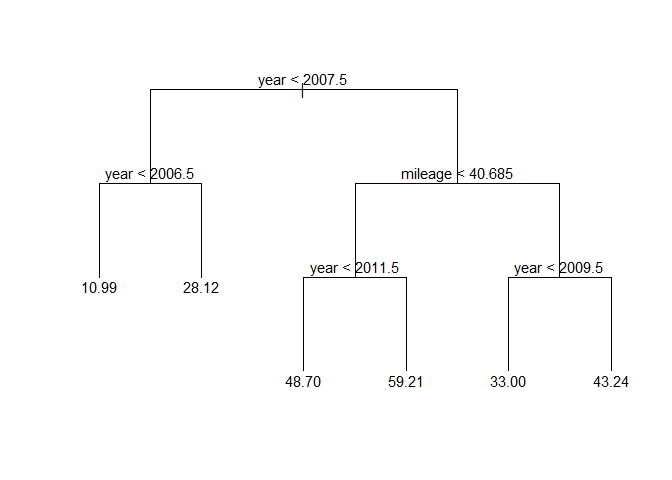

<b>APS Modelagem Preditiva</b>
================
<b>Grupo:</b> Arthur Wachslicht, Gabriel Moritz, Pedro Osorio Magaldi
Netto, Rodrigo Nobel
24/11/2020

<style>body {
text-align: justify}
</style>

\(~\)

# **Introdução**

A atividade a seguir tem como objetivo central o estudo, explicação,
aplicação e avaliação da performance dos mais diversos métodos
preditivos para uma base de classificação (k-NN, Regressão Logística,
Árvore de Classificação, Random Forest e Boosting) e uma de regressão
(Regressão Linear Múltipla, Árvore de Regressão, Random Forest e
Boosting).

Vale ainda introduzir o conceito de divisão da base de dados entre
conjuntos de treino e de teste. Tal divisão é comumente realizada, uma
vez que permite treinar e desenvolver os modelos, assim como treiná-los
com uma mesma base, criando compartimentos insulados dentro dela mesma,
garantindo que não há influência dos dados de teste na construção dos
modelos, e que o modelo é elaborado de forma totalmente independente dos
dados de teste. A divisão entre conjuntos de treino é teste é utilizada
em todos os modelos apresentados à diante. Desta forma, os modelos
apresentados são construídos na base de treinamento e testados na base
de teste, que possui novos dados que o modelo nunca viu, de forma que
possamos avaliar melhor a performance dos modelos.

# **Explicação dos Conceitos**

## **K-NN**

Um classificador do tipo k-NN (k Nearest Neighbour) é relativamente
simples, se baseando apenas num conjunto de dados já existente para
construir um classificador capaz de classificar a qual grupo pertence
uma nova entrada. O início da construção do classificador se dá na
determinação de um valor para k. Tendo este determinado, analisamos cada
ponto já existente no conjunto de dados e observamos os k “vizinhos”
mais próximos do dado de interesse; a classificação observada dos k
dados que o cercam determina a categoria estimada para este dado. Sendo
assim, a ideia principal do classificador k-NN é a de que, observações
tendem a ser parecidas com que está próximo delas.

Para que tudo fique mais tangível, podemos considerar que somos uma loja
de departamentos e gostaríamos de saber se um cliente comprará (Verde)
ou não (Vermelho) de nossa loja. Para fazer esta estimativa, temos
apenas informações sobre sua renda e sua idade. Ainda, determinamos um
valor de k=3.

<center>


</center>

Ao inserirmos os dados de algum novo cliente (ponto Azul) no plano
Idade//Renda, podemos estimar se ele comprará, ou não de nossa loja, com
base nos três pontos que são seus vizinhos mais próximos. No caso
exposto abaixo, o novo cliente possui dois vizinhos próximos Vermelhos
(que não compraram) e um vizinho Verde (que comprou), pela maioria,
determinamos que o ponto em questão deveria ser classificado como um
ponto Vermelho, o novo cliente (dados seus níveis de Idade e Renda) não
compraria em nossa loja.

<center>


</center>

O Conceito apresentado pode ainda ser aplicado para diversas outras
bases de dados, e não apenas bases com dois parâmetros (features) sendo
observados. Em casos com mais dimensões continuaremos avaliando a
distância euclidiana entre os pontos para determinar a classificação do
novo dado. Por último, vale ressaltar ainda que o KNN trata-se de um
método supervisionado, o que significa que dentro dos dados de
treinamento conhecemos a variável resposta que estamos tentando estimar
(neste exemplo, se o cliente comprou ou não comprou). Ademais, além do
uso da distância euclidiana, o KNN ainda pode se utilizar de outros
tipos de distâncias como por exemplo a distância cosseno (cosine
distance).

## **Regressão Logística**

A ideia por trás da regressão logística é estimar um modelo em que ao
inserir as variáveis de entrada ele retorne a probabilidade da
observação ser do grupo de interesse. Com essa probabilidade,
definimos um ponto de corte, ou seja, uma regra para montar o
classificador.

Por exemplo, definimos que se ao inserir algumas características sobre a
saúde de um indivíduo, o modelo estimar que a probabilidade de ele
desenvolver uma certa doença é acima de 60%, o classificamos como alto
risco, caso contrário não.

O primeiro passo para a construção deste classificador é estimar os
coeficientes do modelo abaixo, que dá a probabilidade da observação ser
da categoria de interesse.

<center>


</center>

Essa função vem de transformações do modelo de regressão linear, para
adequá-lo a situações de classificação, dado que um modelo de regressão
linear pode retornar uma estimativa fora do intervalo \[0,1\], o que
seria inadequado. Para solucionar isso, utiliza-se como variável
resposta o log-odds, que pode receber valores no intervalo (-inf, inf).

<center>


</center>

Isolando a probabilidade da variável binária ser da categoria de
interesse, dado o regressor, chega-se ao modelo de cima.

O método utilizado para estimar os coeficientes é o de máxima
verossimilhança, a sua intuição é a partir das observações utilizadas
chegar a parâmetros pro modelo, de modo que ao inserir as variáveis
preditoras o modelo estime uma probabilidade próxima de 1 para as
observações em que a variável binária de interesse é 1 e uma
probabilidade próxima de 0 para as observações em que a variável binária
é 0. As estimativas para os coeficientes são encontradas maximizando a
função abaixo, o que é simples de fazer pelo R.

<center>


</center>

Abaixo está o modelo com os seus coeficientes estimado.

<center>


</center>

Depois, inserindo as variáveis preditoras da observação que deseja
classificar, encontra a probabilidade da variável de interesse ser 1.

Ainda falta definir uma regra para classificar o indivíduo. Isto é feito
definindo um ponto de corte, ou seja, se a probabilidade da variável de
interesse ser 1 dado as preditoras for acima do ponto de corte,
classifica como 1, se abaixo como 0.

## **Árvores de Classificação**

As árvores de classificação fazem parte dos modelos que se utilizam de
árvores de decisão (CART, classification and regression trees). Este
tipo de modelo define um conjunto de regras através de uma sequência de
divisões binárias no dados em busca de classificar um determinado
conjunto de dados como sendo de uma certa classe. Para melhor entender
este modelo, vejamos um exemplo prático: Suponha que queremos utilizar
os dados de peso e comprimento de uma determinada peça de um automóvel
para prever se esta peça possui ou não defeito. Para isso plotamos os
dados no espaço das variáveis preditoras.

<center>


</center>

No gráfico acima os pontos vermelhos representam as peça com defeitos e
os pontos verdes as peças sem defeitos. O modelo de árvores de
classificação fará então a divisão dos dados conforme descrito no
gráficos abaixo, por exemplo:

<center>


</center>

Dessa forma, ao se dividir o espaço das variáveis preditoras, formam se
regiões que serão utilizadas para determinar se uma peça é defeituosa ou
não. Assim, suponha que pegamos uma peça do conjunto de teste e a
inserimos neste espaço formado acima.

<center>


</center>

Nota-se então que a peça do conjunto de teste (ponto azul) se localiza
na região a.) do gráfico. Sendo assim, para classificar esta peça a
árvore de classificação se utilizará do “voto da maioria”, isto é, a
peça será classificada como a classe predominante (dentre os dados de
treinamento) dentro da região a.). Por conseguinte, a peça do conjunto
de teste inserida seria classificada neste caso como não defeituosa.
Este modelo descrito acima pode ser então representado por uma árvore de
decisão a seguir:

<center>


</center>

Por último, vale ressaltar ainda que a árvore de classificação toma a
decisão de como dividir o espaço das variáveis preditoras, como chegar
na regra de classificação, através de um método que busca minimizar o
erro de treinamento do modelo, isto é, minimizar o número de observações
que seriam classificadas como erradas dentro do conjunto de treinamento.

## **Árvores de Regressão**

As árvores de regressão fazem parte dos modelos que se utilizam de
árvores de decisão (CART, classification and regression trees). A ideia
central por trás das árvores de regressão é a de realizar separações
splits na base de dados. Cada split passa a ser representado como uma
bifurcação na árvore, que normalmente leva a outros splits, sejam eles
observando a mesma variável, ou outra na base de dados. Considerando uma
base de dados (representada abaixo) com apenas duas variáveis (nível de
criminalidade e distância da casa até o centro da cidade) sendo
observadas para determinar o preço das casas.

Tendo uma região segmentada por um split, os pontos que estiverem
inseridos na mesma assumem o valor correspondente à média dos pontos já
presentes. Sendo assim, os pontos onde os splits são realizados são
aquele que proporcionam menor Erro Quadrático Médio (EQM) de
treinamento.

Como exemplo, podemos observar a base de dados abaixo, que apresenta
dois parâmetros (features) -o nível de criminalidade e a distância até o
centro- para dez imóveis em uma cidade, além de seus respectivos preços.
Como é sabido, há um tradeoff entre viés e variância e para esta base, o
equilíbrio dos dados se daria com três splits, uma vez que o modelo não
fica sobre-ajustado para o conjunto de treino (viés), e ao mesmo tempo,
consegue reagir bem a alterações de dados (variância).

<center>


</center>

<center>


</center>

Como pode-se observar, após os splits serem realizados, pode-se
representar estas classificações como uma árvore, como a representada
abaixo.

<center>


</center>

A árvore representada possui quatro folhas, ou nós terminais, cada um
representando o valor estimado via árvore de classificação para um novo
dado sendo investigado. As figuras abaixo contribuem para a visualização
das diferentes área e suas correspondentes folhas na árvore.

<center>


</center>

Caso desejássemos adicionar um dado de teste, ele seria posicionado em
uma das quatro áreas representadas acima e a estimativa do modelo para o
preço do imóvel se daria pela média entre os valores daquela categoria.

## **Regressão Linear**

A regressão linear pode ser simples ou múltipla.

A ideia por trás da simples é construir um modelo que estime um valor
médio para a variável de interesse condicionada ao valor de uma outra.
Por exemplo, um modelo que ao colocar um valor para a ingestão diária de
calorias retorne uma estimativa para o peso médio dos indivíduos que
ingerem essa quantidade de calorias.

A regressão linear simples é um modelo linear nos seus parâmetros e tem
apenas uma variável de entrada, ou seja, é do tipo:

\[
\Large{Y = \beta_{0} + \beta_{1}{X} + \epsilon}
\]

Y é a variável de interesse e X a de entrada.

As suas estimativas tendem a ser mais precisa, quanto mais linear for a
relação entre a variável de interesse e a de entrada. Se a relação entre
a ingestão de calorias e o peso de indivíduos for como na primeira
figura abaixo, uma regressão linear entre essas duas variáveis tende a
levar a estimativas no geral mais adequadas do que se a relação entre as
variáveis for como a da segunda figura abaixo.

<center>


</center>

Também é possível chegar a estimativas mais precisas em alguns casos
realizando transformações nas variáveis, para tentar linearizar a
associação entre elas.

O método usual para estimar os parâmetros do modelo, para ele dar a
estimativa quando inserir a variável de entrada, é a partir da amostra
que tem acesso utilizar o método de mínimos quadrados ordinários, que
encontra valores para os parâmetros que minimizam a soma dos resíduos, a
diferença entre o valor estimado e o observado para a amostra.

A regressão linear múltipla segue o princípio da simples, mas incorpora
mais variáveis de entrada, por isso ela consegue em diversas situações
gerar estimativas mais precisas pra variável de interesse. Este modelo
continua tendo que ser linear nos parâmetros e do tipo:

\[
\Large{Y = \beta_{0} + \beta_{1}{X}_{1} + \beta_{2}{X}_{2} + ... + \beta_{n}{X}_{n} + \epsilon}
\]

O método usual para estimar os seus parâmetros também é o de mínimos
quadrados ordinários.

A regressão linear múltipla dada a sua simplicidade e praticidade é
utilizada muitas vezes como o benchmark para os outros modelos
preditivos.

A seguir, vemos, de forma mais matemática, como funciona o modelo de
regressão linear múltipla com p variáveis preditoras e n observações
para estimar o modelo:

<center>

**Regressão Linear Múltipla:**

</center>

\[ 
\Large{{Y} = {X} \beta + \epsilon} 
\] \[
\Large{\beta = \begin{bmatrix}
       {\beta}_{0} \\[0.3em]
       \vdots      \\[0.3em]
       {\beta}_{p} \\[0.3em]
     \end{bmatrix} \texttt{   } {;} \texttt{   } 
     \epsilon = \begin{bmatrix}
       {\epsilon}_{1} \\[0.3em]
       \vdots      \\[0.3em]
       {\epsilon}_{n} \\[0.3em]
     \end{bmatrix} \texttt{   } {;} \texttt{   } 
     {X} = \begin{bmatrix}
       {1}  & {x}_{11} & {x}_{12} & \ldots & {x}_{1p-1} & {x}_{1p}          \\[0.3em]
       \vdots &  \vdots &  \vdots & \vdots & \vdots & \vdots                 \\[0.3em]
       1    & {x}_{n1} & {x}_{n2} & \ldots & {x}_{np-1} & {}_{np}   
     \end{bmatrix}  \texttt{   } {;} \texttt{   } 
     {Y} = \begin{bmatrix}
       {y}_{1} \\[0.3em]
       \vdots      \\[0.3em]
       {y}_{n} \\[0.3em]
       \end{bmatrix}}
\]

\[ 
\Large{\hat{\beta} = (X^{T} \cdot X)^{-1}\cdot X^{T} \cdot Y}
\]

## **Random Forest**

O algoritmo de Random Forest (florestas aleatórias) é um método de
machine learning que está incluído na categoria de métodos ensamble, uma
vez que combina os resultados de múltiplos modelos, melhorando assim os
resultados. Desta forma, o algoritmo combina múltiplas árvores de
decisão de forma a melhorar a capacidade preditiva do modelo,
acrescentando o Bagging (agregação Bootstrap) às árvores de decisão, o
que reduz a variância do modelo. Após diversas reamostragens aleatórias
com repetição, o algoritmo de Bagging calcula a média da previsão de
todos os modelos combinados (em árvores de regressão) ou utiliza o “voto
da maioria” (em árvores de classificação) para determinar o valor (no
caso da regressão) ou a categoria (no caso da classificação) que será
atribuída aos dados de teste.

A Random Forest parte da ideia do bagging: a partir da amostra que tem
acesso criar outras, embaralhando estes dados com reposição, para
crescer novas árvores e tirar a média da previsão delas, para tentar
reduzir a variância do classificador final, só que isto pode não ser
muito efetivo dado que haveria correlação entre as árvores. Visando
quebrar esta correlação as Random Forests embaralham também as variáveis
preditoras utilizadas para crescer a árvore, o que tende a mitigar a
correlação entre elas e, ao final, levar a um classificador com uma
menor variância, o que tende a levar a previsões mais precisas, em
média, do que as de uma árvore simples.

**Random Forest para regressão:**

<center>


</center>

**Random Forest para classificação:**

<center>


</center>

## **Boosting para classificação**

A ideia por trás do boosting é a de partir de um classificador, como uma
árvore, ir adaptando-o iteradamente, atribuindo pesos aos dados de
treinamento, com base no erro deste classificador nos dados de
treinamento, buscando influenciar a performance do próximo
classificador. No final deste processo utiliza-se todos estes
classificadores ponderados por um peso para a classificação dos dados de
teste.

Funcionamento do Boosting para classificação:

**1 -** Treina uma árvore.

**2 -** Computa o erro de treinamento deste classificador.

**3 -** Atualiza os pesos dos dados de treinamento, de modo que os dados
classificados corretamente, mantenham os seus pesos, e os
incorretamente, tenham os seus pesos elevados, de modo a tentar corrigir
essas classificações com o próximo classificador. O aumento dos pesos
tende a ser maior, quanto maior for o erro total do classificador
computado no passo 2.

**4 -** Com os pesos atualizados, roda o processo outra vez. Repete-se
este processo quantas vezes quiser. Vale ressaltar que a quantidade de
iterações utilizadas pode influenciar significativamente o classificador
final e que não necessariamente a escolha de muitas repetições vai levar
ao melhor resultado, podendo levar a uma piora da performance.

**5 -** Utiliza como classificador a agregação de todos os
classificadores ponderados por um peso que tende a ser maior, quanto
menor o erro do classificador. Como a resposta desses classificadores é
-1 ou 1, soma a resposta de cada classificador ponderada pelo seu peso e
com base no sinal encontrado classifica o objeto de interesse.

## **Boosting para Regressão**

No contexto de regressão, o boosting parte do mesmo princípio de ir
gerando novos modelos, que tenham uma performance melhor, só que este
possui significativas diferenças na construção do modelo final. Passos
para a sua construção:

**1 -** Utiliza um modelo que retorna o valor médio da variável de
interesse.

**2 -** Calcula o resíduo deste modelo nos dados de treinamento.

**3 -** Utilizando estes resíduos como a variável de interesse das
variáveis de entrada, constrói uma árvore de regressão.

**4 -** Cria-se um novo modelo que dará o valor previsto do antigo,
adicionada a previsão do resíduo pela árvore, ponderada por um valor
entre 0 e 1, com o intuito de ir aproximando a previsão do modelo ao
dado observado.

**5 –** Repete-se este processo quantas vezes forem desejadas.

**6 –** Utiliza-se o último modelo gerado para a previsão.

Vale ressaltar que a escolha do peso a dar pros novos modelos dos
resíduos, quando são somados ao anterior, podem alterar a performance,
tendo assim que achar um equilíbrio entre 0 e 1. Geralmente valores
pequenos para este parâmetro leva a resultados mais adequados.

# **Código e Análise da Implementação dos Modelos**

### **Importando as bibliotecas que serão utilizadas**

``` r
library(caret)
library(dplyr)
library(class)
library(tidyr)
library(doParallel)
library(plyr)
library(randomForest)
library(ISLR)
library(tree)
library(pROC)
library(fastAdaboost)
library(gbm)
library(gridExtra)
```

## **Problemas de Classificação**

### **Importando a base churn**

``` r
churn <-  read.csv("churn.csv")
```

### **Análise descritiva - churn**

``` r
plot01 = churn %>% ggplot(aes(y = CreditScore, x = as.factor(Exited))) +
  geom_boxplot(fill = "blue") + labs(title = "Credit Score x Exited")

plot02 = churn %>% ggplot(aes(y = Balance, x = as.factor(Exited))) +
  geom_boxplot(fill = "blue") + labs(title = "Balance x Exited")

plot03 = churn %>% ggplot(aes(y = EstimatedSalary, x = as.factor(Exited))) +
  geom_boxplot(fill = "blue") + labs(title = "Salário Est x Exited")

grid.arrange(plot01, plot02, plot03,  ncol=3)
```

<!-- -->

``` r
a=data.frame(tapply(churn$Exited, churn$Geography, mean))
b=data.frame(tapply(churn$Exited, churn$Gender, mean))
c=data.frame(tapply(churn$Exited, churn$NumOfProducts, mean))
d=data.frame(tapply(churn$Exited, churn$IsActiveMember, mean))

colnames(a) = c("Churned")
colnames(b) = c("Churned")
colnames(c) = c("Churned")
colnames(d) = c("Churned")


df = rbind(a,b,c,d)


rownames(df) = c("France","Germany","Spain","Female","Male","1 Product",
               "2 Products","3 Products","4 Products","Active Member","Not an Active Member")

df$Churned = round(df$Churned*100,2)

colnames(df) = c("Churned(%)")

df
```

    ##                      Churned(%)
    ## France                    16.15
    ## Germany                   32.44
    ## Spain                     16.67
    ## Female                    25.07
    ## Male                      16.46
    ## 1 Product                 27.71
    ## 2 Products                 7.58
    ## 3 Products                82.71
    ## 4 Products               100.00
    ## Active Member             26.85
    ## Not an Active Member      14.27

``` r
summary(churn)
```

    ##    RowNumber       CustomerId           Surname      CreditScore   
    ##  Min.   :    1   Min.   :15565701   Smith   :  32   Min.   :350.0  
    ##  1st Qu.: 2501   1st Qu.:15628528   Martin  :  29   1st Qu.:584.0  
    ##  Median : 5000   Median :15690738   Scott   :  29   Median :652.0  
    ##  Mean   : 5000   Mean   :15690941   Walker  :  28   Mean   :650.5  
    ##  3rd Qu.: 7500   3rd Qu.:15753234   Brown   :  26   3rd Qu.:718.0  
    ##  Max.   :10000   Max.   :15815690   Genovese:  25   Max.   :850.0  
    ##                                     (Other) :9831                  
    ##    Geography       Gender          Age            Tenure          Balance      
    ##  France :5014   Female:4543   Min.   :18.00   Min.   : 0.000   Min.   :     0  
    ##  Germany:2509   Male  :5457   1st Qu.:32.00   1st Qu.: 3.000   1st Qu.:     0  
    ##  Spain  :2477                 Median :37.00   Median : 5.000   Median : 97199  
    ##                               Mean   :38.92   Mean   : 5.013   Mean   : 76486  
    ##                               3rd Qu.:44.00   3rd Qu.: 7.000   3rd Qu.:127644  
    ##                               Max.   :92.00   Max.   :10.000   Max.   :250898  
    ##                                                                                
    ##  NumOfProducts    HasCrCard      IsActiveMember   EstimatedSalary    
    ##  Min.   :1.00   Min.   :0.0000   Min.   :0.0000   Min.   :    11.58  
    ##  1st Qu.:1.00   1st Qu.:0.0000   1st Qu.:0.0000   1st Qu.: 51002.11  
    ##  Median :1.00   Median :1.0000   Median :1.0000   Median :100193.91  
    ##  Mean   :1.53   Mean   :0.7055   Mean   :0.5151   Mean   :100090.24  
    ##  3rd Qu.:2.00   3rd Qu.:1.0000   3rd Qu.:1.0000   3rd Qu.:149388.25  
    ##  Max.   :4.00   Max.   :1.0000   Max.   :1.0000   Max.   :199992.48  
    ##                                                                      
    ##      Exited      
    ##  Min.   :0.0000  
    ##  1st Qu.:0.0000  
    ##  Median :0.0000  
    ##  Mean   :0.2037  
    ##  3rd Qu.:0.0000  
    ##  Max.   :1.0000  
    ## 

Podemos notar pela análise descritiva que na base Churn, o salário e
Credit Score dos indivíduos que saíram do serviço (Exited = 1) está
próximo do daqueles que permaneceram, tanto em termos das medianas,
quanto em termos de variações (amplitudes) dos parâmetros observados.

Um outro fator importante da base analisada é o fato de que
aproximadamente 20,37% da base é composta por observações de clientes
que saíram (Exited = 1) e 79,67% da base composta por clientes que não
saíram (Exited = 0). Sendo assim, para a previsão relacionada à variável
Exited, possivelmente uma acurácia menor que 79% não indicaria uma boa
capacidade preditiva do modelo, já que poderíamos obter uma acurácia
próxima disso ao apenas formular um modelo que sempre prevê que o
cliente não sairá.

Pode-se observar ainda, que há uma maior variabilidade em Balance para
os clientes que não deixaram o serviço (Exited = 0).

Algo interessante a ser notado é que a porcentagem de clientes que
saíram do serviço (Exited =1) é extremamente elevada para cliente com
três e quatro produtos, com 82,71% para o primeiro grupo e 100% para o
segundo. Observando tais dados, pode-se entender que a companhia não é
capaz de atender bem as necessidades de seus clientes maiores, fazendo
com que a maioria dos mesmos deixe a empresa. Por outro lado, clientes
menores (que compram um ou dois produtos) parecem estar tendo suas
necessidades bem atendidas pela companhia, com 27,71% e 7,58% dos
clientes deixaram a companhia respectivamente.

Por último, como podemos ver pela tabela, os alemães têm uma taxa de
churn quase o dobro da dos franceses e espanhóis, que estão próximas em
16%. Em relação ao gênero dos indivíduos, vemos que as mulheres tem um
churn mais elevado de 25% em relação a 16% dos homens. Se o indivíduo é
membro, vemos que a taxa de churn deles é mais elevada 27% contra 14%
dos que não são.

### **Estruturando a base churn:**

``` r
churn$France = ifelse(churn$Geography == "France",1,0)
churn$Germany = ifelse(churn$Geography == "Germany",1,0)
churn$Male = ifelse(churn$Gender == "Male",1,0)

str(churn)

churn <- churn %>%
  select(-c(RowNumber,CustomerId,Surname,Geography,Gender )) %>%
  mutate(Exited = as.factor(as.logical(Exited)))
```

### **Definindo as bases de teste e treino para a base churn**

``` r
train_numbers <- createDataPartition(churn$CreditScore, p = 0.5,list = FALSE)

train_set <- churn[train_numbers,]

test_set <- churn[-train_numbers,]
```

### **K-NN**

``` r
normalize <- function(x){(x - mean(x))/sd(x)}


test_set_norm <- sapply(test_set %>% select(-Exited), normalize) %>% as.data.frame()
test_set_norm$Exited <- test_set$Exited


train_set_norm <- sapply(train_set %>% select(-Exited), normalize) %>% as.data.frame()
train_set_norm$Exited <- train_set$Exited

true_prediction = c()

for (i in seq(1, 100)) {
 
 
  knn_fit <- knn(train = train_set_norm %>% select(-Exited),
                 test = test_set_norm %>% select(-Exited),
                 cl = train_set_norm$Exited,
                 k=i)
 
  true_prediction[i] <- mean(test_set_norm$Exited == knn_fit)
 
}

plot(true_prediction, xlab = "K", ylab = "Accuracy", main = "Modelos KNN, Variando o K")
```

<!-- -->

``` r
best_k = which.max(true_prediction)

y_hat_knn <-  knn(train = train_set_norm %>% select(-Exited),
                  test = test_set_norm %>% select(-Exited),
                  cl = train_set_norm$Exited,
                  k=best_k,prob = TRUE)

knn_accuracy = mean(test_set_norm$Exited == y_hat_knn)

higher_prob <- attr(y_hat_knn, "prob")

prob_knn <- ifelse(y_hat_knn == TRUE, higher_prob, 1 - higher_prob)

confusion_knn <- table(Predicted = y_hat_knn, Observed = test_set$Exited)

confusion_knn
```

    ##          Observed
    ## Predicted FALSE TRUE
    ##     FALSE  3827  723
    ##     TRUE    149  300

### **Regressão Logística**

``` r
model_reglog <- glm(Exited~.,data=train_set, family=binomial)

prob_reglog <- predict(object = model_reglog, newdata = test_set,type="response")

y_hat_reglog <- ifelse(prob_reglog>0.5,TRUE,FALSE)

reglog_accuracy <- mean(y_hat_reglog == test_set$Exited)

confusion_reglog <- table(Predicted = y_hat_reglog, Observed = test_set$Exited)

confusion_reglog
```

    ##          Observed
    ## Predicted FALSE TRUE
    ##     FALSE  3855  809
    ##     TRUE    121  214

### **Árvores de Classificação**

``` r
model_ctree <- tree(Exited~.,data=train_set)

y_hat_ctree <- predict(object = model_ctree, newdata = test_set, type = "class")

ctree_accuracy <- mean(y_hat_ctree == test_set$Exited)

prob_ctree <- predict(object = model_ctree, newdata = test_set, type = "vector")[,2]

confusion_ctree <- table(Predicted = y_hat_ctree, Observed = test_set$Exited)

confusion_ctree
```

    ##          Observed
    ## Predicted FALSE TRUE
    ##     FALSE  3891  717
    ##     TRUE     85  306

``` r
plot(model_ctree, type = "uniform")
text(model_ctree, cex = 0.95)
```

<!-- -->

### **Random Forest para classificação**

``` r
model_crf <- randomForest(Exited ~ ., data = train_set)

y_hat_crf <- predict(object = model_crf, newdata = test_set)

crf_accuracy <- mean(y_hat_crf == test_set$Exited)

prob_crf <- predict(object = model_crf, newdata = test_set, type = "prob")[,2]

confusion_crf <- table(Predicted = y_hat_crf, Observed = test_set$Exited)

confusion_crf
```

    ##          Observed
    ## Predicted FALSE TRUE
    ##     FALSE  3841  565
    ##     TRUE    135  458

### **Boosting para classificação**

``` r
model_cbst <- adaboost(Exited ~ ., data = train_set, nIter = 100)

y_hat_cbst <- predict(object = model_cbst, newdata = test_set)

cbst_accuracy <- mean(y_hat_cbst$class == test_set$Exited)

prob_cbst <- y_hat_cbst$prob[,2]

confusion_cbst <- table(Predicted = y_hat_cbst$class, Observed = test_set$Exited)

confusion_cbst
```

    ##          Observed
    ## Predicted FALSE TRUE
    ##     FALSE  3760  543
    ##     TRUE    216  480

### **Curvas ROC**

``` r
plot.roc(test_set$Exited,prob_crf,
         xlab = "False Positive Rate",
         ylab = "True Positive Rate",
         main = "Curvas ROC",col="blue",legacy.axes=TRUE)

plot.roc(test_set$Exited, prob_reglog,col = "green", add = TRUE)

plot.roc(test_set$Exited, prob_ctree,col = "red", add = TRUE)

plot.roc(test_set$Exited, prob_knn, col = "yellow", add = TRUE)

plot.roc(test_set$Exited, prob_cbst, col = "black", add = TRUE)

legend("topleft", legend = c("Random Forest", "Regressão Logística", "Árvore de Classificação"," KNN", "Boosting"),
       col = c("blue", "green", "red", "yellow", "black"), lwd = 2, cex = 0.5)
```

<!-- -->

### **AUC dos Modelos**

``` r
knn_auc <- auc(test_set_norm$Exited, prob_knn)

reglog_auc <- auc(test_set$Exited,prob_reglog)

crf_auc <- auc(test_set$Exited, prob_crf)

ctree_auc <- auc(test_set$Exited, prob_ctree)

cbst_auc <- auc(test_set$Exited, prob_cbst)

df_auc <- data.frame(Modelo = c("KNN", "Regressão Logística", "Árvores de Classificação"
                              ,"Random Forest","Boosting"), AUC = c(knn_auc,
                              reglog_auc,ctree_auc,crf_auc,cbst_auc))
df_auc
```

    ##                     Modelo       AUC
    ## 1                      KNN 0.7839826
    ## 2      Regressão Logística 0.7596835
    ## 3 Árvores de Classificação 0.8078733
    ## 4            Random Forest 0.8521138
    ## 5                 Boosting 0.8262468

### **Acurácia dos Modelos**

``` r
df_accuracy <- data.frame(Modelo = c("KNN", "Regressão Logística", "Árvores de Classificação"
                                     ,"Random Forest","Boosting"), Acurracy = c(knn_accuracy,
                                                                      reglog_accuracy,ctree_accuracy,crf_accuracy,cbst_accuracy))

df_accuracy
```

    ##                     Modelo  Acurracy
    ## 1                      KNN 0.8255651
    ## 2      Regressão Logística 0.8139628
    ## 3 Árvores de Classificação 0.8395679
    ## 4            Random Forest 0.8599720
    ## 5                 Boosting 0.8481696

## **Análise dos Resultados (Modelos de Classificação)**

Pelos resultados vistos na curva ROC, na tabela das acurácias de cada
modelo e na tabela das AUC’s de cada modelo, vemos que o modelo de
Random Forest parece ter tido a melhor performance.

Analisando pela tabela de acurácias de cada modelo temos que a Random
Forest obteve uma acurácia de 86%, o que significa que, tendo em vista
que a acurácia representa a proporção de acertos do modelo (ou 1 menos a
proporção de erros do modelo), a Random Forest parece ter classificado
corretamente 86% das observações do conjunto de teste utilizado. Além
disso, o pior modelo parece ter sido a regressão logística, com uma
acurácia de 81%.

Olhando pela curva ROC, vemos que a Random Forest parece ter o melhor
desempenho entre os modelos de classificação. A curva ROC analisa como a
relação entre a taxa de verdadeiro positivo (observações classificadas
como “verdadeiras” e que de fato são “verdadeiras”) e a taxa de falso
positivo (observações classificadas como “verdadeiras” mas que são
“falsas”) evolui conforme o ponto de corte (threshold) vai crescendo.
O ponto de corte é um ponto definido de tal forma que valores superiores
a ele seriam classificados como “verdadeiros” e valores inferiores
classificados como “falso”.

Para melhor explicar o ponto de corte, suponha que temos uma regressão
logística que nos retorna a probabilidade de um indivíduo ter câncer. Ao
definir um ponto de corte (threshold) de x isso significa que caso a
regressão logística retorne uma probabilidade acima de x,
classificaremos o indivíduo como “tem câncer”, caso contrário,
classificaremos o indivíduo como “não tem câncer”. Dessa forma, a curva
ROC analisa a evolução entre a taxa de verdadeiro positivo e a taxa de
falso positivo conforme vamos aumentando o valor de x. Podemos ilustrar
melhor as taxas de verdadeiro positivo (true positive) e as taxas de
falso positivo (false positive) por meio da tabela de confusão.

<center>


</center>

<center>


</center>

Dessa forma, uma maior taxa de verdadeiro positivo (Sensibilidade) é
algo bom, enquanto uma maior taxa de falso positivo (1-Especificidade) é
algo ruim. Portanto, podemos utilizar a área embaixo da curva ROC (AUC
ou Area under the Curve) para nos dar um indicador de performance de um
modelo preditivo, variando de 0 (no caso de um modelo que sempre erra)
até 1 (no caso de um modelo que sempre acerta). Por consequência,
analisando as AUC’s e as curvas ROC de cada um dos modelos podemos ver
que a Random Forest parece ter a melhor performance, enquanto a
Regressão Logística parece ter tido a pior performance dentro do
conjunto de teste.

## **Problemas de Regressão**

### **Importando a base cars**

``` r
cars <-  read.csv("used_cars.csv")
```

### **Análise descritiva - cars**

``` r
plot1 <- cars %>% ggplot(aes(y = price, x = color)) +
  geom_boxplot(fill = "blue") + labs(title = "Preço x Cor")

plot2 <- cars %>% ggplot(aes(y = price, x = isOneOwner)) +
  geom_boxplot(fill = "blue") + labs(title = "Preço x Primeiro Dono")

plot3 <- cars %>% ggplot(aes(y = price, x = fuel)) +
  geom_boxplot(fill = "blue") + labs(title = "Preço x Combustível")

plot4 <- cars %>% ggplot(aes(y = price, x = soundSystem)) +
  geom_boxplot(fill = "blue") + labs(title = "Preço x Sistema de Som")

plot5 <- cars %>% ggplot(aes(y = price, x = wheelType)) +
  geom_boxplot(fill = "blue") + labs(title = "Preço x Roda")

plot6 <- cars %>% ggplot(aes(y = price, x = trim)) +
  geom_boxplot(fill = "blue") + labs(title = "Preço x Trim")

grid.arrange(plot1, plot2, plot3, plot4, plot5, plot6, ncol=3)
```

<!-- -->

``` r
plot7 <- cars %>% ggplot(aes(y = price, x = mileage)) +
  geom_point(color = "blue", alpha = 0.1) + labs(title = "Preço x Mileage")

plot8 <- cars %>% ggplot(aes(y = price, x = year)) +
  geom_point(color = "blue", alpha = 0.1) + labs(title = "Preço x Year")

plot9 <- cars %>% ggplot(aes(y = price, x = displacement)) +
  geom_point(color = "blue", alpha = 0.1) + labs(title = "Preço x Displacement")

grid.arrange(plot7, plot8, plot9, ncol=3)
```

<!-- -->

``` r
summary(cars)
```

    ##      price           trim       isOneOwner         mileage       
    ##  Min.   : 0.599   430  : 2787   Mode :logical   Min.   :  0.008  
    ##  1st Qu.:13.495   500  : 2661   FALSE:16594     1st Qu.: 39.889  
    ##  Median :29.454   550  :11825   TRUE :3469      Median : 67.187  
    ##  Mean   :30.747   Other: 2790                   Mean   : 73.114  
    ##  3rd Qu.:43.995                                 3rd Qu.: 98.213  
    ##  Max.   :79.999                                 Max.   :488.525  
    ##       year         color            fuel              soundSystem  
    ##  Min.   :1994   Black :8194   Diesel  :  211   Bang Olufsen : 104  
    ##  1st Qu.:2004   Other :4875   Gasoline:19632   Bose         :1261  
    ##  Median :2007   Silver:4353   Hybrid  :  220   Harman Kardon:4278  
    ##  Mean   :2007   White :2641                    Premium      :5320  
    ##  3rd Qu.:2010                                  unsp         :9100  
    ##  Max.   :2014                                                      
    ##    wheelType      displacement  
    ##  Alloy  :11111   Min.   :3.000  
    ##  other  :  120   1st Qu.:4.600  
    ##  Premium:  428   Median :5.500  
    ##  unsp   : 8404   Mean   :5.059  
    ##                  3rd Qu.:5.500  
    ##                  Max.   :6.300

``` r
cor(cars$price,cars$displacement)
```

    ## [1] 0.2025805

``` r
cor(cars$price,cars$mileage)
```

    ## [1] -0.7946903

``` r
cor(cars$price,cars$year)
```

    ## [1] 0.8819488

### **Estruturando os dados**

``` r
cars <-  read.csv("used_cars.csv")

price = cars$price

cars = model.matrix(price ~ ., data = cars)

cars = data.frame(cars)

cars$price = price

str(cars)
```

Conforme o esperado, podemos observar pelo boxplot que compara o preço
do carro com relação a sua condição (primeiro dono ou não), que carros
novos tendem a ter maiores níveis de preço, o que faz sentido dado que
carros usados em geral tendem a perder valor com o uso. Nesta mesma
linha, podemos observar que carros com uma maior quilometragem (mileage)
tendem a também terem preços mais baixos, enfatizando a relação já
esperada de que os carros tendem a perder valor de acordo com o seu uso.

Como podemos observar na análise de preços com relação ao combustível
utilizado pelo veículo, a gasolina é a que possui maior amplitude de
valores e mediana mais baixa. Tanto diesel, quanto híbridos apresentam
mediana superior à gasolina, além de apresentarem amplitudes bem menores
de preços, possuindo apenas alguns outliers em preços muito baixos ou
muito elevados.

A última variável que parece ter grande influência nos preços dos
veículos é o sistema de som que ele possui, sendo a marca Bang Olufsen
a que possui mediana mais elevada, seguida pela Harman Kardon.

Como podemos ver pelos boxplots do preço dos carros, os pretos e brancos
estão concentrados em preços mais elevados do que os de outras cores. Os
veículos que estão com o primeiro comprador estão com os preços
concentrados em valores mais elevados, mais do que 75% destes carros tem
preços maiores do que o preço mediano dos que já tiveram mais donos.

Como também pode-se observar, o material da roda do veículo parece não
ter tanta influência sobre o preço dos carros quando são vendidos.

Por fim, a análise das variáveis quantitativas traz confirmação a
diversas suspeitas. Como pode-se observar, o preço possui uma relação
negativa com a quilometragem (mileage) do veículo, possuindo inclusive
uma correlação de -0,7947, ou seja, quando observamos um aumento na
quilometragem do veículo, tendemos a observar uma queda no seu preço.
Com relação ao ano do veículo, também observamos uma tendência similar,
já que carros mais novos tendem a ter preços mais elevados, com uma
correlação de 0,8819. O gráfico da cilindrada com o preço mostra uma
relação dúbia entres essas variáveis, sem padrões significativos no
gráfico e uma correlação de apenas 0,2025.

### **Definindo as bases de treino e de teste para a base cars**

``` r
train_numbers <- createDataPartition(cars$price, p = 0.7,list = FALSE)

train_set <- cars[train_numbers,]

test_set <- cars[-train_numbers,]
```

### **Regressão Linear Múltipla**

``` r
model_mlr <- lm(price~., data = train_set)

y_hat_mlr <- predict(model_mlr,newdata=test_set)

MSE_mlr <- mean((y_hat_mlr-test_set$price)**2)

RMSE_mlr <- sqrt(MSE_mlr)
```

### **Árvore de Regressão**

``` r
model_rtree <- tree(price~.,data=train_set)

y_hat_rtree <- predict(model_rtree,newdata=test_set)

MSE_rtree <- sqrt(mean((y_hat_rtree-test_set$price)**2))

RMSE_rtree <- sqrt(MSE_rtree)
```

``` r
plot(model_rtree, type = "uniform")
text(model_rtree, cex = 0.95)
```

<!-- -->

### **Random Forest para Regressão**

``` r
model_rrf <- randomForest(price~.,data=train_set)

y_hat_rrf <- predict(model_rrf,newdata=test_set)

MSE_rrf <- sqrt(mean((y_hat_rrf-test_set$price)**2))

RMSE_rrf <- sqrt(MSE_rrf)
```

### **Boosting para Regressão**

``` r
train_set$isOneOwner = as.numeric(train_set$isOneOwner)
test_set$isOneOwner = as.numeric(test_set$isOneOwner)

model_rbst <- gbm(price ~ ., data = train_set, distribution = "gaussian",
                  n.trees = 1000, interaction.depth = 5,shrinkage = 0.002)

y_hat_rbst <- predict(model_rbst, newdata = test_set, n.trees = 1000)

MSE_rbst <- sqrt(mean((y_hat_rbst-test_set$price)**2))

RMSE_rbst <- sqrt(MSE_rbst)
```

### **Comparando os modelos pelo RMSE (Raiz quadrada do EQM)**

``` r
df_rmse <- data.frame(Modelo = c("Regressão Linear", "Árvores de Regressão", "Random Forest",
                                 "Boosting"), RMSE = c(RMSE_mlr,RMSE_rtree,RMSE_rrf,RMSE_rbst))
df_rmse
```

    ##                 Modelo     RMSE
    ## 1     Regressão Linear 6.793404
    ## 2 Árvores de Regressão 2.588815
    ## 3        Random Forest 2.096461
    ## 4             Boosting 2.376609

### **Análise dos Resultados (Modelos de Regressão):**

Como esperado, seguindo o observado para os modelos de classificação, o
modelo Random Forest foi aquele que obteve a melhor performance com
relação aos demais modelos disponíveis. Como pode-se observar na tabela
acima, a Random Forest obteve a menor raiz do erro quadrático médio
(EQM) nos dados de teste. Vale ressaltar que o método de Boosting também
obteve excelente performance, sendo o que possui a segunda menor raiz de
EQM. Portanto, tendo se em vista que a raiz do EQM representa o quanto o
modelo erra em média, podemos dizer que, para os dados de teste
utilizados, a Random Forest em média erra menos.

\[ 
\large{EQM = \frac{\sum_{i=1}^{n}({v_{i}-r_{i}})^2}{n}}
\]

\[ 
\large{v_{i} = \texttt{Valor previsto} \texttt{  } ; \texttt{  } r_{i} = \texttt{Valor observado}}
\]

De acordo com as expectativas do grupo, o modelo de regressão linear
múltipla foi aquele que apresentou a pior performance entre os quatro
testados pelo grupo. Ainda de acordo com as expectativas, a árvore de
regressão apresentou performance inferior à Random Forest, que faz uso
do mecanismo de Bootstrap e é capaz de quebrar as correlações entre as
diversas árvores utilizadas em sua construção.
